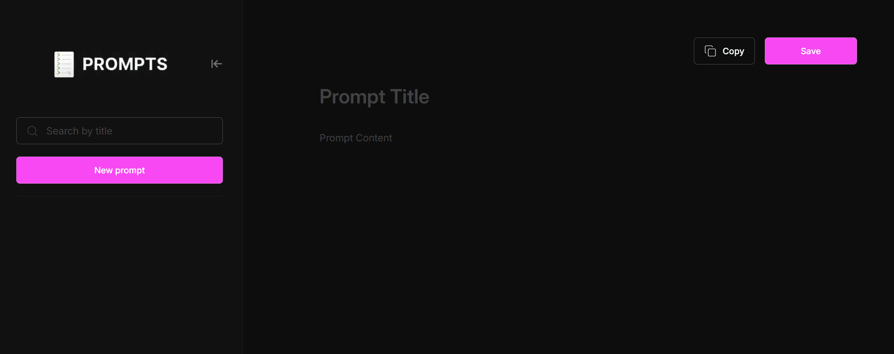

<h1 align="center"> Prompt Manager Project 💻</h1>

Minimalist dark-themed app for creating, saving, and managing custom prompts efficiently.

  
  <a href="#-live-demo">Live Demo</a>&nbsp;&nbsp;&nbsp;|&nbsp;&nbsp;&nbsp;
  <a href="#-screenshots">Screenshots</a>&nbsp;&nbsp;&nbsp;|&nbsp;&nbsp;&nbsp;
  <a href="#-technologies">Technologies</a>&nbsp;&nbsp;&nbsp;|&nbsp;&nbsp;&nbsp;
  <a href="#-features">Features</a>&nbsp;&nbsp;&nbsp;|&nbsp;&nbsp;&nbsp;
  <a href="#-license">License</a>&nbsp;&nbsp;&nbsp;|&nbsp;&nbsp;&nbsp;
  <a href="#-contributing">Contributing</a>&nbsp;&nbsp;&nbsp;|&nbsp;&nbsp;&nbsp;
  <a href="#support">Support</a>  

  

 

 

## 🌐 Live Demo

  

  Tip: Use right-click → “Open in new tab”.

 

## 📸 Screenshots

 

## 🛠 Technologies

- HTML5  
- CSS3  
- JavaScript (Vanilla)
- MCP
- Figma
- Saving with LocalStorage
- Git and GitHub

 

## ✨ Features

* Save, copy and delete your prompts

 

## 📜 License

* This project is licensed under the [MIT License](https://choosealicense.com/licenses/mit/)

 

## 🫱🏻‍🫲🏻 Contributing

 Contributions, issues, and feature requests are welcome! Please, feel free to do it! 😉 

 

## 🌟 Support

 If you like this project, please give it a star ⭠and share it with others! 😄 

